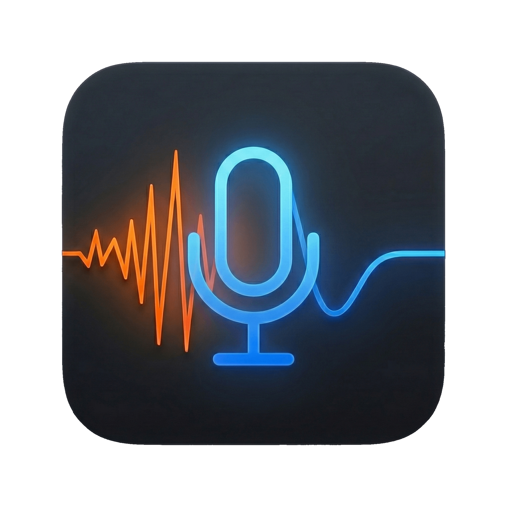

  

  # MetalVoice 

  **AI-Powered Noise Suppression for macOS**

  
  [-lightgrey.svg?style=flat-square)](https://www.apple.com/mac/)
  
  

  

    <b>MetalVoice</b> uses state-of-the-art Deep Learning (DeepFilterNet) to eliminate background noise and room reverb in real-time. 
     
    Built exclusively for <b>Apple Silicon</b>, leveraging the Neural Engine for zero-latency performance.
  

  

 

> [!IMPORTANT]
> **Requirement**: This application **REQUIRES a Mac with Apple Silicon (M1, M2, M3, or newer)**. It relies on the Apple Neural Engine and Metal Performance Shaders optimized for these chips. It will not work on Intel Macs.

---

## ✨ Features

*   **🚫 Silence the Noise**: Instantly removes fans, typing, air conditioning, and background chatter.
*   **🗣️ Studio Clarity**: De-reverberation clears up "roomy" echoes, making you sound like you're in a studio.
*   **⚡ Zero Latency Feel**: Optimized Metal pipeline ensures negligible delay tailored for real-time communication.
*   **🔒 Privacy First**: 100% On-Device. Your voice is processed locally on your Neural Engine. No data leaves your Mac.
*   **🛠️ Universal**: Works with **any** microphone (USB, XLR, Built-in) and outputs to **any** app via virtual cables.

## 📥 Installation

1.  **Download**: Get the latest version from the [Releases Page](https://github.com/Ghostkwebb/MetalVoice/releases/latest).
2.  **Unzip**: Extract `MetalVoice_v1.0.zip`.
3.  **Install**: Drag `MetalVoice.app` to your **Applications** folder.
4.  **Open**: Right-click and choose **Open** (necessary for the first launch to verify the developer).
    *   *Note: If prompted about "Malicious Software", go to System Settings -> Privacy & Security -> Open Anyway.*

## 🚀 Usage Guide

  
   

1.  **Launch**: Look for the **Waveform Icon 🌊** in your menu bar.
2.  **Select Input**: Click the gear ⚙️ icon. Set **Input Device** to your physical microphone.
3.  **Select Output**: Set **Output Device** to a Virtual Audio Cable (Recommended: **[BlackHole 2ch](https://github.com/ExistentialAudio/BlackHole)**).
    *   *This routes the "Clean" audio into the cable.*
4.  **Configure Apps**: inside Discord/Zoom/OBS, set your **Microphone Input** to that same Virtual Cable (e.g., BlackHole 2ch).
5.  **Enable AI**: Toggle the switch **ON** in the MetalVoice menu. Enjoy crystal clear audio!

## 💻 Tech Stack

*   **Core**: Swift 5, SwiftUI
*   **Audio**: AVFoundation, Accelerate (vDSP)
*   **AI Engine**: CoreML + Metal Performance Shaders (MPS)
*   **Model**: [DeepFilterNet3](https://github.com/Rikorose/DeepFilterNet) (Streaming UNet)

## 🙏 Credits

*   **DeepFilterNet**: Developed by [Hendrik Schröter (Rikorose)](https://github.com/Rikorose). DeepFilterNet is one of the most efficient noise suppression models available. MetalVoice uses a custom CoreML implementation of this architecture.
*   **Icons**: SF Symbols by Apple.

---

  
Made with ❤️ for macOS

